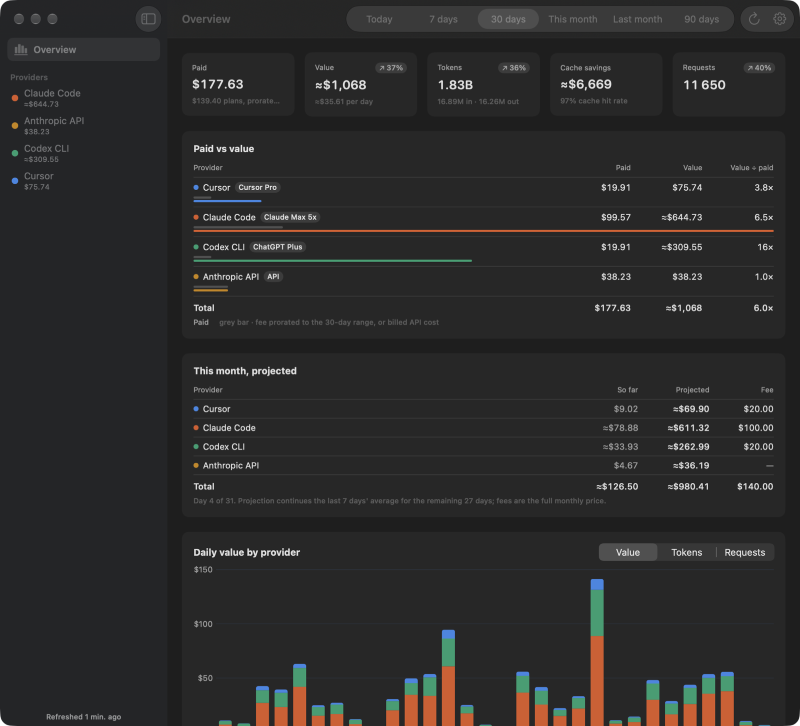
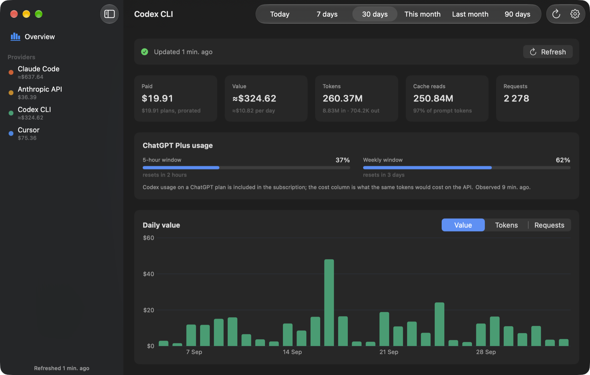
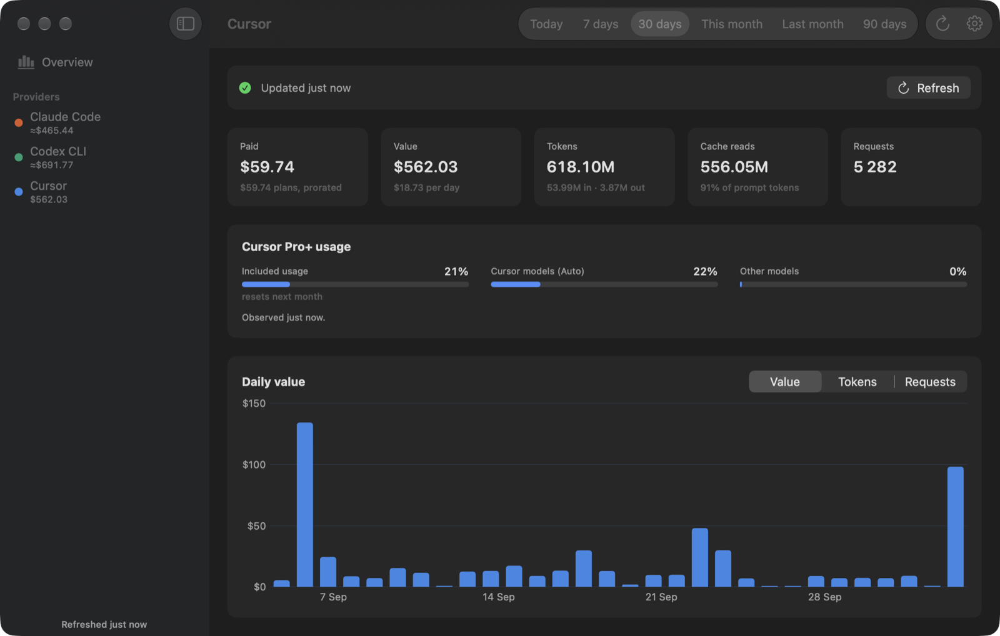
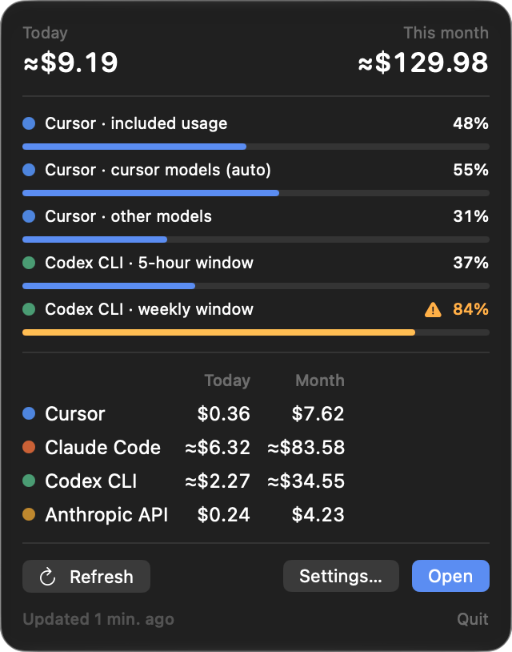
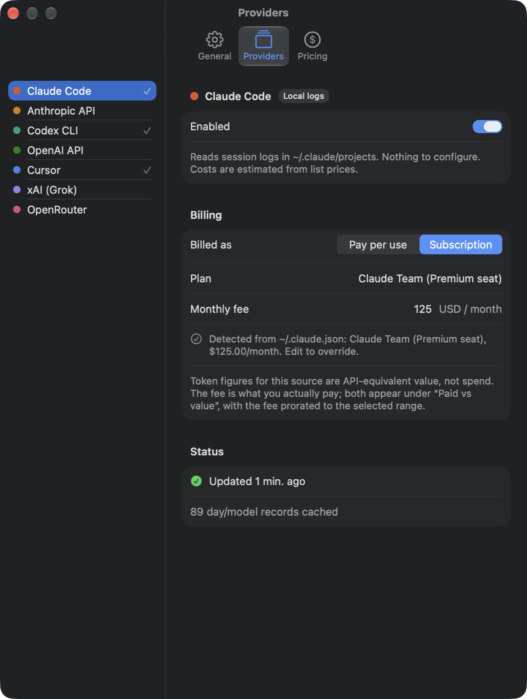

# Overhead

A native macOS app (SwiftUI, menu bar + window) that shows how much you use and spend across LLM providers in one place: daily cost and token charts, per-model breakdowns, and a menu bar item with today's spend.

## Screenshots



| Provider page with plan limits (Codex) | Provider page with plan limits (Cursor) |
|---|---|
|  |  |

| Menu bar | Settings → Providers |
|---|---|
|  |  |

## Providers

| Provider | How data is obtained | What you get |
|---|---|---|
| **Claude Code** | Parses `~/.claude/projects/**/*.jsonl` (and the Claude desktop app's agent-mode logs). No setup. | Tokens per model and day, request counts, cost **estimated** from list prices (incl. 5m/1h cache-write pricing). |
| **Codex CLI** | Parses `~/.codex/sessions/**/*.jsonl` and `archived_sessions`. No setup. | Tokens per model and day, API-equivalent cost estimate, and your ChatGPT plan's 5-hour / weekly usage windows. |
| **Anthropic API** | Admin API key (`sk-ant-admin…`). | Org-wide token usage by model plus billed cost from the cost report. |
| **OpenAI API** | Admin API key (`sk-admin…`). | Org-wide completions usage by model plus billed cost by line item. |
| **Cursor** | Personal plans (Pro/Pro+/Ultra): your cursor.com login session, imported from the Cursor app with one click or pasted from the browser. Teams: Admin API key. | Per-request tokens and charged cents per model and day, plus the plan's included-usage budget and billing cycle. |
| **xAI (Grok)** | Management API key + Team ID. | Billed USD per model and day (no token counts in the API). |
| **OpenRouter** | API key; optional Management key. | Today's spend from the key endpoint; with a Management key, 30 days of per-model history. |

### What about the chat apps themselves?

Subscriptions are covered as far as their coding tools expose them, not beyond:

- **ChatGPT plan** (Plus, Pro, Business): Codex writes the plan tier and its rolling usage windows into its logs, so Overhead shows those. Your use of the ChatGPT app itself (conversations, images, deep research) is not exposed by any official API and is not shown.
- **Claude plan** (Pro, Max, Team seat): Claude Code's local logs give tokens and the account profile gives the tier. The claude.ai chat usage and the plan's 5-hour/weekly windows come from an undocumented endpoint that Anthropic's terms reserve for its own clients, so they are not shown.
- **Grok** (grok.com, X Premium): no API at all. Grok usage inside Cursor is captured through Cursor.

### A note on Cursor personal plans

Cursor has no official usage API for individual subscriptions. The app uses the same JSON endpoints the cursor.com dashboard page calls (`/api/usage-summary` and `/api/dashboard/get-filtered-usage-events`), authenticated with your `WorkosCursorSessionToken` login cookie. This is what every third-party Cursor usage tool does, but it is reverse-engineered and may break when Cursor changes its dashboard.

Two ways to provide the session, both in Settings → Providers → Cursor:

- **Import from Cursor app** reads the access token the Cursor desktop app keeps in `~/Library/Application Support/Cursor/User/globalStorage/state.vscdb` (opened read-only, on a private copy; nothing is written back and no refresh token is touched). Cursor refreshes that token itself, so if the session expires, open Cursor and import again.
- **Paste the cookie**: on cursor.com, open the browser dev tools → Application → Cookies → copy the value of `WorkosCursorSessionToken`.

The session is stored in the macOS Keychain and sent only to `cursor.com`.

### Paid vs value

Subscription sources (Codex on a ChatGPT plan, Cursor Pro/Pro+/Ultra, Claude Code on a seat) charge a flat monthly fee, so the per-token dollar figures the app computes for them are **API-equivalent value**, not spend: what the same tokens would have cost at the vendor's API list prices. The app detects the tier where it can and pre-fills the list price: Cursor from the account endpoint (`/api/auth/stripe`, which distinguishes Pro+ from Pro and knows about annual billing), Codex from the `plan_type` in its logs, Claude Code from the organization type and seat tier cached in `~/.claude.json`. Detected values can be edited in Settings → Providers → Billing; a typed fee is never overwritten, and "Use detected" switches back. Tier prices live in `OverheadCore/Sources/OverheadCore/Pricing/PlanPrices.swift` (Cursor Pro/Pro+/Ultra $20/$60/$200, ChatGPT Plus/Pro 100/Pro 200/Pro 500 $20/$100/$200/$500, Claude Pro/Max/Team seats; reviewed 2026-10-04). The dashboard then shows a "Paid vs value" table with the fee prorated to the selected range (a whole calendar month counts once; a 7-day range counts about a quarter of a month) next to the value used, and the value ÷ paid multiple. Pay-per-use providers show their billed cost as "paid".

Costs marked `≈` are estimates computed from the vendor's published list prices (`OverheadCore/Sources/OverheadCore/Pricing/PriceTable.swift`). Unmarked costs come straight from a billing endpoint.

## Install

Download the latest `Overhead-<version>.dmg` from the [Releases page](../../releases), open it and drag Overhead to Applications. Releases are signed with a Developer ID certificate and notarized by Apple.

## Privacy

Overhead runs entirely on your Mac and has no telemetry or backend of its own.

- **Local sources** are read from files the tools already keep on disk: Claude Code transcripts under `~/.claude/projects` and Claude Code's account profile in `~/.claude.json`, Codex session logs under `~/.codex`. Only token counts, model names, timestamps and plan identifiers are extracted; prompt and response text is never parsed, stored or displayed.
- **Network requests** go only to the vendor you configured: `api.anthropic.com`, `api.openai.com`, `api.cursor.com`, `cursor.com`, `management-api.x.ai`, `openrouter.ai`.
- **Credentials** (API keys, the Cursor login session) live in the macOS Keychain under the app's bundle identifier. "Import from Cursor app" reads the session from a read-only private copy of Cursor's local state database only when you press the button; nothing is written back.
- **Caches** of parsed usage are stored under `~/Library/Application Support/Overhead` and can be cleared from Settings → General.

## Build & run

Requirements: Xcode 26+, [xcodegen](https://github.com/yonaskolb/XcodeGen) (`brew install xcodegen`).

Install a signed Release build into /Applications (uses your Developer ID or Apple Development certificate if you have one, ad-hoc signing otherwise):

```bash
./scripts/install.sh
```

Pass a directory to install elsewhere, e.g. `./scripts/install.sh ~/Applications`.

For development, `./scripts/run.sh` builds and launches from the build folder, or open `Overhead.xcodeproj` in Xcode (after `xcodegen generate`) and press Run.

Navigate with the sidebar, the Go menu, or ⌘1 for the overview and ⌘2… for each provider; provider rows on the overview are clickable too. Settings → General has a "Launch at login" toggle (uses `SMAppService`; the app should live in /Applications for that).

### Releasing a notarized DMG

Downloads from GitHub are checked by Gatekeeper, so release builds are signed with a Developer ID certificate, notarized by Apple and stapled. One-time setup, with an app-specific password from account.apple.com:

```bash
xcrun notarytool store-credentials overhead-notary --apple-id you@example.com --team-id XXXXXXXXXX --password <app-specific-password>
```

Then, for each release:

```bash
./scripts/release.sh 0.1.0            # dist/Overhead-0.1.0.dmg, notarized and stapled
./scripts/release.sh 0.1.0 --publish  # same, then creates the GitHub release with gh
```

Or let GitHub Actions do it: pushing a tag `v<version>` runs `.github/workflows/release.yml`, which imports the Developer ID certificate from repository secrets, notarizes, and publishes the release. Set the secrets once with `scripts/setup-release-secrets.sh`. Run it without arguments and it exports your signing identities (certificate plus private key) from the login keychain itself; or pass a `.p12` you exported from Xcode → Settings → Accounts → Manage Certificates… → Export Certificate…. Then:

```bash
git tag v0.2.0 && git push origin v0.2.0
```

The script builds Release with hardened runtime and a secure timestamp, notarizes the app, staples it, wraps it in a DMG with an Applications shortcut, then notarizes and staples the DMG too, and writes a SHA-256 next to it. `--skip-notarize` produces a signed but un-notarized DMG for local testing.

The screenshots above were taken with synthetic data: `open /Applications/Overhead.app --args -demoData YES` runs the app on generated usage without reading, fetching or saving anything.

### Core package tests and debug CLI

The parsing/aggregation logic lives in the `OverheadCore` Swift package and has no UI dependencies:

```bash
cd OverheadCore
swift test                      # parser + API adapter tests (mocked HTTP)
swift run overhead 30               # print per-model totals from local logs for the last 30 days
```

## Architecture

```
Overhead/                 SwiftUI app (xcodegen target)
  App/AppModel.swift         @Observable state: records, statuses, credentials, refresh timer
  App/ProviderRegistry*.swift  which adapter backs each ProviderID
  Views/                     Dashboard, provider detail, settings, menu bar
OverheadCore/             Swift package, unit-tested
  Models/                    ProviderID, UsageRecord (normalized day × model row), DateRangePreset
  Providers/                 One UsageProvider per source (local log parsers + HTTP adapters)
  Pricing/PriceTable.swift   list prices used for estimates
  Aggregation/               totals, per-model, daily series
  Storage/                   Keychain, per-provider JSON cache, incremental file-parse cache
```

Every adapter emits `UsageRecord`s: one row per (provider, local calendar day, model) with input / output / cache-write / cache-read tokens, request count, and a cost that is `reported`, `estimated`, or `unknown`. The UI only understands that shape, so adding a provider means implementing `UsageProvider.fetch` and adding a case to `ProviderID`.

Local parsers keep a per-file index (size + mtime → parsed entries) under `~/Library/Application Support/Overhead/index/`, so after the first run only new or changed session files are re-read. API results are cached under `.../Overhead/cache/` so the app shows data instantly on launch.

Credentials are stored in the macOS Keychain (service `app.overhead`, the bundle identifier), never in files.

## Adding a provider

1. Add a case to `ProviderID` (name, kind, palette slot, setup hint).
2. Implement a `UsageProvider` in `OverheadCore/Sources/OverheadCore/Providers/`, declaring any `credentialFields`.
3. Register it in `Overhead/App/ProviderRegistry+Providers.swift`.
4. Add a fixture under `OverheadCore/Tests/.../Fixtures` and a test.

## License

MIT, see [LICENSE](LICENSE).
